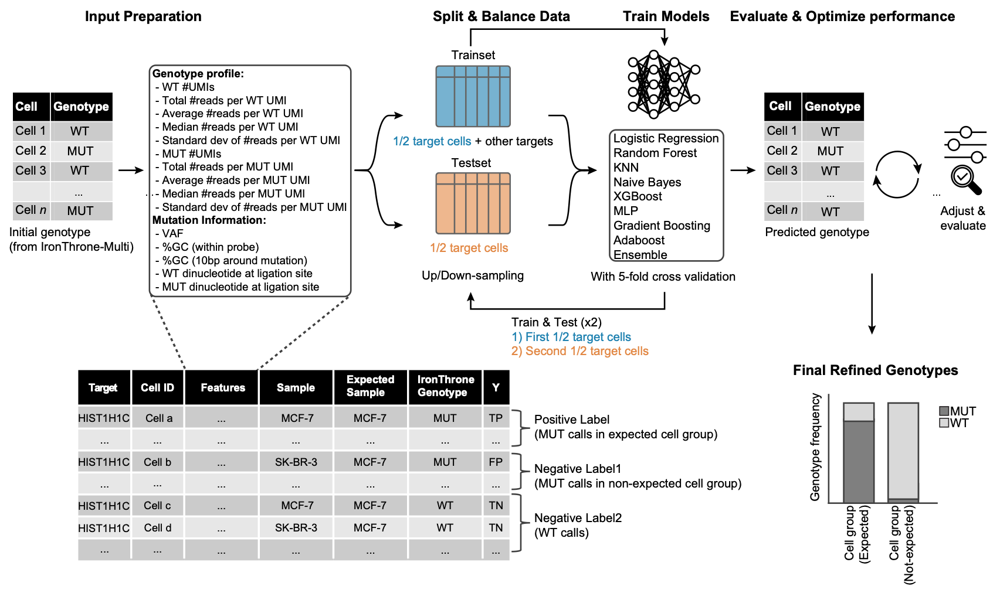

# GoT-Multi-ML

**_GoT-Multi-ML_** is the analytical pipeline for **_GoT-Multi_ (Genotyping of Transcriptomes for Multiple Targets and Sample Types)**, a high-throughput and FFPE (formalin-fixed paraffin-embedded) tissue-compatible single-cell multi-omics method for simultaneous genotyping of multiple somatic mutations and whole transcriptomic profiling. 
Specifically, **_GoT-Multi-ML_** is a pipeline for turning **_GoT-Multi_** genotyping sequencing output into a single-cell genotyping table.
It is designed for users who already completed the GoT-Multi experiment and now have the sequencing FASTQ files.

At a high level, GoT-Multi-ML does two things:

1. runs genotyping on the GoT-Multi genotyping reads and merges the gene-sequence and probe-barcode evidence into one initial genotype table
2. optionally applies machine-learning denoising, using GEX metadata and target annotations, to remove likely false-positive mutant calls

If you only need the initial merged genotype profile, you can stop after step 1.
If you have the information needed to define false-positive mutant calls, you can continue to step 2.



For general IronThrone background, see the original [IronThrone-GoT](https://github.com/dan-landau/IronThrone-GoT).
For the standalone multi-target genotyping module used inside this pipeline, see the [IronThrone-Multi README](1_ironthrone_multi_py/README.md).

## Quick Start

### Step 1. Run GoT-Multi genotyping

```bash
bash run_got_multi_ml.sh \
  --id MY_RUN \
  --mut-params /path/to/params_gene_seq.txt \
  --barcode-params /path/to/params_probe_bc.txt \
  --outdir /path/to/output/MY_RUN
```

Main outputs:

- `/path/to/output/MY_RUN/ironthrone_out_pp.csv`
- `/path/to/output/MY_RUN/initial_genotype_counts_by_target.pdf`

The CSV is the initial complete GoT-Multi genotype profile.
It contains the gene-sequence genotype, the probe-barcode genotype, and the merged genotype for each cell-target pair.
The PDF is a stage-1 summary plot showing genotype category counts for each target, using only the paired genotyping output.

### Step 2. Optional ML-based denoising

```bash
bash run_got_multi_ml_denoise.sh \
  --got-multi-outdir /path/to/output/MY_RUN \
  --gex /path/to/sc_gex.h5ad \
  --target-info /path/to/target_info.csv \
  --cell-group cell_group \
  --negative-control-cell-group "T-cell,Macrophage" \
  --additional-features "nCount_RNA,nFeature_RNA,percent.mt"
```

Main output:

- `/path/to/output/MY_RUN/ml_denoise/got_multi_out_refined.csv`

This file is the refined genotype profile after ML-based denoising.
Its final genotype column is `genotype_final`.
Only cells present in both the genotyping output and the GEX object are included in this step.

## Pipeline Overview

### Step 1 output: initial genotype profile

`run_got_multi_ml.sh` wraps standalone IronThrone-Multi in the GoT-Multi-specific way required for the Fixed RNA Profiling assay.
GoT-Multi genotyping evidence comes from two parts of the probe:

- gene sequence
- probe barcode

Because of that, IronThrone-Multi is run twice:

- once with mutation or gene-sequence configs
- once with probe-barcode configs

The wrapper then merges the two runs into one table.
The main stage-1 output is `ironthrone_out_pp.csv`, which contains:

- `genotype_geneseq`
- `genotype_probebc`
- `genotype_merged`

This stage does not require a GEX object.
For many use cases, this is already the final result.

<details>
<summary>Show step 1 details</summary>

#### What `run_got_multi_ml.sh` does

- uses the mutation or gene-sequence params file as the source of expected-sequence information
- runs standalone IronThrone-Multi for the gene-sequence pass
- reuses the prepared input FASTQs for the probe-barcode pass instead of repeating the full input-prep work
- swaps only the IronThrone config paths for the probe-barcode run
- merges the two runs into one paired genotype table

#### Required inputs for step 1

- `--mut-params`: params file for the gene-sequence pass
- `--barcode-params`: params file for the probe-barcode pass
- paired FASTQ files referenced by those params files
- target config files referenced by those params files
- barcode whitelist referenced by those params files

#### Main outputs from step 1

- `<OUTDIR>/GeneSeq_<ID>_Results/`
- `<OUTDIR>/ProbeBC_<ID>_Results/`
- `<OUTDIR>/ironthrone_out_pp.csv`
- `<OUTDIR>/initial_genotype_counts_by_target.pdf`
- `<OUTDIR>/wrapper_input/params_gene_seq.generated.txt`
- `<OUTDIR>/wrapper_input/params_probe_bc.generated.txt`
- `<OUTDIR>/wrapper_input/expected_sequence.csv` only when the expected-sequence file had to be generated by the wrapper

</details>

### Step 2 output: refined genotype profile

`run_got_multi_ml_denoise.sh` is optional.
Use it only if you have enough information to define which mutant calls are likely false positives.
That usually means one or both of the following are available:

- expected sample information for each target
- negative-control cell groups in the GEX object

This step prepares ML input features from:

- the stage-1 genotype table
- the GEX object
- the target-info table

It then runs the denoising model and writes `got_multi_out_refined.csv`.

<details>
<summary>Show step 2 details</summary>

#### Required inputs for step 2

- `--got-multi-outdir`: output directory from step 1
- `--gex`: AnnData `.h5ad` object for the same experiment
- `--target-info`: CSV describing target-level expected-sample information and any target-level ML features

#### What the GEX object must provide

The GEX object is read from `.obs` and must contain:

- `BC`
- `sample`
- the column you pass through `--cell-group`

Optional but supported:

- `experiment`
- `is_non_mut`
- any columns listed in `--additional-features`

If `is_non_mut` is not already present in GEX metadata, the pipeline derives it from `--negative-control-cell-group` and the chosen `--cell-group` column.

#### What the target-info table must provide

Required columns:

- `target`
- `sample` or `expected_sample`

A target may have multiple expected samples.
You can represent that either by:

- repeating the target across multiple rows
- putting a comma-separated list in one row

All non-reserved target-info columns are carried forward as target-level ML features. Columns `sample`, `expected_sample`, and `experiment` may be present in `target_info`, but they are excluded from ML features. `sample` or `expected_sample` are used only to define expected-sample labels, and `experiment` is kept only as context. These columns are intentionally excluded from model input because they can leak experimental batch information or the definition of the labels themselves, which would give the model too much direct information.

#### Important behavior in step 2

- the pipeline intersects GEN and GEX by barcode and keeps only cells present in both
- mutant calls in any expected sample are labeled as candidate true mutant calls
- mutant calls outside the expected sample set are labeled `FalsePositive`
- mutant calls in negative-control cell groups are also labeled `FalsePositive`

#### Main outputs from step 2

- `<ML_OUTDIR>/ironthrone_out_pp_ml_input.csv`
- `<ML_OUTDIR>/got_multi_out_refined.csv`

</details>

## Input Files You Need

### 1. Gene-sequence params file

This is the IronThrone-Multi params file for the mutation or gene-sequence run.
It points to:

- R1 FASTQs
- R2 FASTQs
- mutation config files
- barcode whitelist
- optional expected-sequence CSV

### 2. Probe-barcode params file

This is the IronThrone-Multi params file for the probe-barcode run.
It usually points to the same FASTQs and the same whitelist, but uses probe-barcode config files.

### 3. GEX object for optional denoising

This is the single-cell expression object in `.h5ad` format.
It is only needed for `run_got_multi_ml_denoise.sh`.

### 4. Target-info table for optional denoising

This table maps targets to their expected sample or samples and can also hold additional target-level ML features.

## Which Output Should You Use?

- If you only want the merged genotyping profile from GoT-Multi, use `ironthrone_out_pp.csv` from step 1.
- If you also run denoising, use `got_multi_out_refined.csv` from step 2.

## Repository Layout

- `1_ironthrone_multi_py/`: standalone IronThrone-Multi
- `2_ironthrone_pp/`: paired post-processing for GoT-Multi
- `3_ironthrone_denoise/`: optional ML-based denoising
- `utils/`: shared helper code
- `requirements.txt`: Python dependencies for this pipeline

## Requirements

At minimum, the pipeline expects:

- Bash
- Python 3
- `seqkit`
- GNU `parallel`
- the Python packages listed in `requirements.txt`

Standalone IronThrone-Multi also depends on the original IronThrone scripts bundled in this repository.
For details on the genotyping module itself, see the [IronThrone-Multi README](1_ironthrone_multi_py/README.md).

---

## Contact
For questions or issues, please contact mip4018@med.cornell.edu

