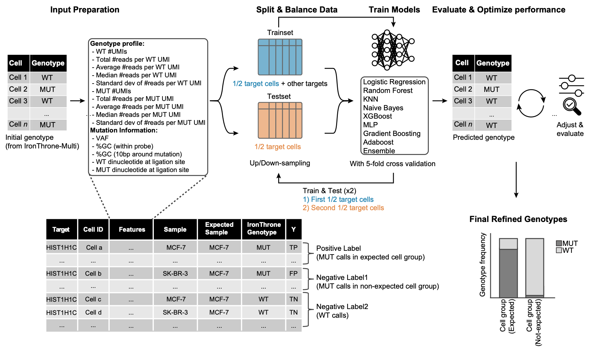

# IronThrone-ML: High-Throughput Single-Cell Genotyping Pipeline

**_IronThrone-ML_** is the analytical pipeline for **_GoT-Multi_ (Genotyping of Transcriptomes for Multiple Targets and Sample Types)**, a high-throughput and FFPE (formalin-fixed paraffin-embedded) tissue-compatible single-cell multi-omics method for simultaneous genotyping of multiple somatic mutations and whole transcriptomic profiling. 
_IronThrone-ML_ extracts genotyping calls from genotyping sequence data and denoise the genotyping calls using machine learning to get the final genotyping profiles.

## Pipeline Overview

1. **[IronThrone-Multi](1_ironthrone_multi/README.md)**
   - Runs the classic [IronThrone](https://github.com/dan-landau/IronThrone-GoT) genotyping pipeline to generate initial single-cell genotyping profiles for each target.
   - **You must run this step to obtain genotyping calls.**
   - > _Since GoT-Multi makes the genotyping calls based on gene sequence part and the barcode part of the probes, this step is run twice (once for gene sequence, once for probe barcode)._

2. **IronThrone-PP**
   - Post-processes IronThrone-Multi output, and prepares features for ML denoising.
   - **ML denoising is only applicable if you have negative control for mutation target. Proceed with this step if you have either:**
     - Multiple samples for each mutation target _(genotyping probe was captured in sample where the target is not expected to be mutated)_, or
     - Negative control cell groups (i.e., cell groups where mutations are not expected (e.g. T-cells), so false positive mutant calls can be defined).

3. **IronThrone-Denoise**
   - Applies machine learning to distinguish false positives from true mutant calls, increasing accuracy of mutation detection.
   - **This step requires the ability to define false positive mutant calls (see above).**



> **Note:** If you do not have negative control cell groups or multiple samples per target, you cannot run the denoising steps (IronThrone-PP and IronThrone-Denoise).

---

## Quick Start

### 1. IronThrone-Multi
Run the initial genotyping pipeline:
```bash
bash run_ironthrone_multi.sh
```
- Prepare input paramter file (`params_gene_seq.txt` and `params_probe_bc.txt`)
- Edit `run_ironthrone_multi.sh` to set your run ID and file/directory paths.
- Output: `<ID>_Results/` with per-target genotyping results.

### 2. IronThrone-PP
Prepare features for ML denoising:
```bash
bash run_ironthrone_pp.sh
```
- Edit `run_ironthrone_pp.sh` to set mutation/barcode result directories, negative control cell group (if available), GEX file, and other options.
- Input:
  - Result directory paths of `Step1`
  - Corresponding single-cell gene expression object (AnnData format), where metadata (`.obs`) must contain the following columns:
      - cell type annotation (`cell-group`)
      - experiment
      - sample
  - Target info csv table (`target-info`)
- Output: `2_ironthrone_pp/output/ironthrone_out_pp.csv`

### 3. IronThrone-Denoise
Run ML-based denoising:
```bash
bash run_ironthrone_denoise.sh
```
- Edit `run_ironthrone_denoise.sh` to set input features, output directory, and ML options.
- Output: `3_ironthrone_denoise/output/aggregated/final_prediction_results_alpha_<alpha>.csv`

---
## What Does IronThrone-ML Denoising Do?
- IronThrone-ML learns the data patterns of false positive mutant calls using machine learning.
- It predicts which mutant calls are likely to be true (specific to expected cell populations) and which are likely to be false positives.
- This increases the accuracy of mutation detection in your single-cell data.

---

## Directory Structure
- `1_ironthrone_multi/` : IronThrone-Multi scripts and configs
- `2_ironthrone_pp/`    : IronThrone-PP post-processing scripts
- `3_ironthrone_denoise/` : IronThrone-Denoise ML scripts
- `utils/`              : Shared utility code

---

## Requirements
- Bash, Python 3, R, Perl, and required Python/R packages (see individual scripts for details)

---

## Contact
For questions or issues, please contact mip4018@med.cornell.edu
